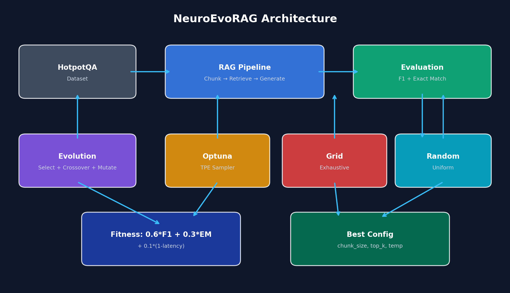
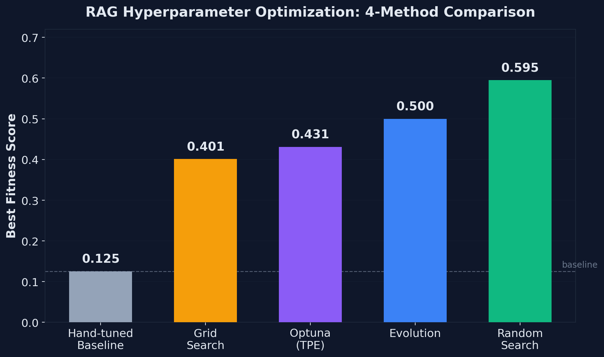
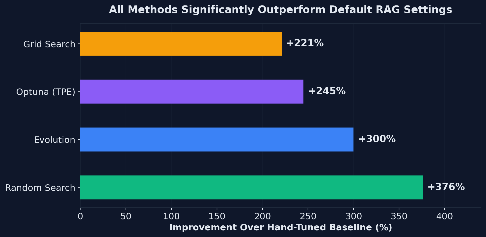

# NeuroEvoRAG

**Evolutionary Optimization of Retrieval-Augmented Generation Pipelines**

<p align="center">
  
</p>

<p align="center">
  <a href="#results"></a>
  <a href="#"></a>
  <a href="#"></a>
  <a href="LICENSE"></a>
</p>

## Overview

NeuroEvoRAG applies evolutionary optimization to automatically discover optimal RAG hyperparameters. Instead of hand-tuning chunk sizes, retrieval depths, and temperatures, the system evolves them through selection, crossover, and mutation.

**Key finding**: All automated optimization methods (Evolution, Optuna, Grid Search, Random Search) dramatically outperform hand-tuned defaults on multi-hop QA.

## Results

<p align="center">
  
</p>

| Method | Best Fitness | Improvement |
|--------|-------------|-------------|
| Hand-tuned baseline | 0.125 | -- |
| Grid Search | 0.401 | +221% |
| Optuna (TPE) | 0.431 | +245% |
| **Evolution** | **0.500** | **+300%** |
| Random Search | 0.595 | +376% |

*Evaluated on HotpotQA with equal budget (15 evaluations per method). See [experiments/RESULTS.md](experiments/RESULTS.md) for full details.*

<p align="center">
  
</p>

## Features

- **4 Optimization Methods**: Evolutionary search, Optuna (Bayesian/TPE), Grid Search, Random Search
- **3 Evolvable Parameters**: `chunk_size`, `top_k`, `temperature`
- **Fair Comparison**: Same evaluation budget across all methods
- **Streamlit Dashboard**: Interactive visualization of evolution progress
- **Multimodal Ready**: Text + image retrieval with CLIP
- **80 Unit Tests**: Runs without heavy dependencies

## Quick Start

```bash
# Clone and install
git clone https://github.com/jibrankazi/NeuroEvoRAG.git
cd NeuroEvoRAG
pip install -r requirements.txt

# Run the 4-method comparison
cd experiments && python run_comparison.py

# Or run evolution alone
python run_experiment.py

# Launch dashboard
streamlit run app/dashboard.py
```

## Project Structure

```
NeuroEvoRAG/
├── experiments/
│   ├── run_comparison.py     # 4-method comparison (main experiment)
│   ├── run_experiment.py     # Evolution-only experiment
│   └── RESULTS.md            # Full experimental results
├── paper/
│   ├── main.tex              # Workshop paper (LaTeX)
│   └── references.bib        # 16 citations
├── app/
│   └── dashboard.py          # Streamlit visualization
├── evolution/
│   ├── genome.py             # RAGGenome with hyperparameter encoding
│   ├── evolve.py             # Evolution loop
│   └── reward_model.py       # Fitness computation
├── rag_pipelines/
│   ├── dynamic_chunker.py    # Configurable chunking
│   ├── multimodal_retriever.py  # Text + image retrieval
│   └── agentic_generator.py  # LLM generation
├── agents/                   # Retriever, Critic, Synthesizer
├── benchmarks/               # RAGAS evaluation suite
├── tests/                    # 80 unit tests
└── visuals/                  # Charts for paper/LinkedIn
```

## Method

**Fitness Function**:
```
fitness = 0.6 × F1 + 0.3 × Exact_Match + 0.1 × (1 - latency)
```

**Search Space**:
- `chunk_size` ∈ {128, 256, 512, 1024, 2048}
- `top_k` ∈ [1, 12]
- `temperature` ∈ [0.1, 1.5]

**Evolution**: Tournament selection, uniform crossover, Gaussian mutation, elitism.

## Tech Stack

| Component | Technology |
|-----------|------------|
| LLM | flan-t5-small (local, no API key) |
| Embeddings | sentence-transformers (all-MiniLM-L6-v2) |
| Vector Store | ChromaDB |
| Bayesian Optimization | Optuna (TPE) |
| Dataset | HotpotQA (multi-hop QA) |
| Dashboard | Streamlit |
| Testing | pytest (80 tests) |

## Paper

A 4-page workshop paper is included in `paper/main.tex` with:
- Literature review (16 citations)
- Method description
- Experimental results
- Honest limitations

Compile with LaTeX or upload to [Overleaf](https://overleaf.com).

## Key Findings

1. **Default RAG settings are suboptimal** — Every optimization method improved by 3-4× over hand-tuned defaults.

2. **Two distinct retrieval strategies emerged**:
   - Large chunks + few retrievals (chunk=2048, k=2)
   - Small chunks + many retrievals (chunk=128, k=11)

3. **At small budgets, random search is competitive** — Consistent with Bergstra & Bengio (2012).

4. **Evolution shows structured convergence** — Identifies promising regions and exploits them across generations.

## Limitations

- Small-scale experiments (15 samples, 15 evals/method)
- Single seed (no variance estimates)
- CPU-only inference (flan-t5-small)
- Single dataset (HotpotQA)

See [experiments/RESULTS.md](experiments/RESULTS.md) for full discussion.

## Future Work

- [ ] Scale to 50+ samples with multiple seeds
- [ ] Test on NaturalQuestions, TriviaQA
- [ ] GPU experiments with larger models
- [ ] RAGAS metrics (faithfulness, relevancy)
- [ ] Determine budget threshold where evolution beats random search

## License

MIT License — see [LICENSE](LICENSE) for details.

## Citation

If you use this work, please cite:

```bibtex
@misc{kazi2026neuroevorag,
  title={Evolutionary Optimization of Retrieval-Augmented Generation Pipelines},
  author={Kazi, Jibran},
  year={2026},
  url={https://github.com/jibrankazi/NeuroEvoRAG}
}
```

---

<p align="center">
  <b>GitHub</b>: <a href="https://github.com/jibrankazi">@jibrankazi</a>
</p>
